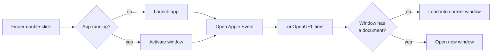
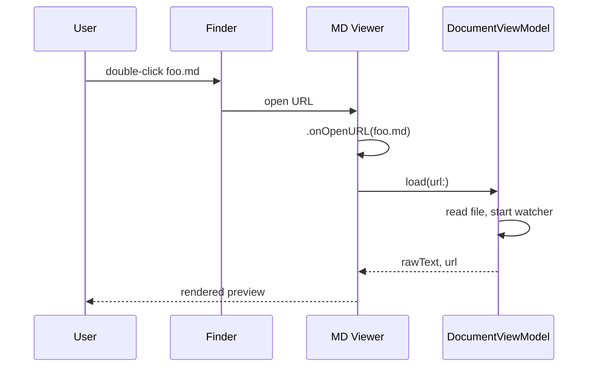
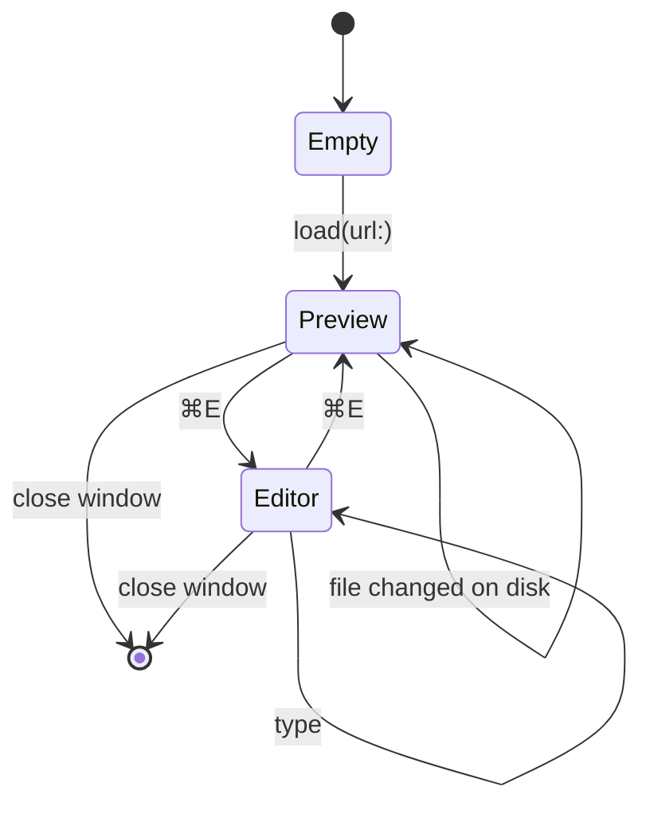

# Diagrams & Notes

Mermaid diagrams, footnotes, task lists, and the kind of structured writing that benefits from a clean reading view.

## A small system

Here's what the app does when you double-click a `.md` file from Finder[^1]:

A typical lifecycle, sequence-style:

And the document state machine:

## Reading notes

Block quotes are good for surfacing claims without burying them in body text:

> The best documentation reads like a confident colleague explaining something at a whiteboard — not like a reference manual, and definitely not like marketing copy.

Nested quotes also work, if you really need to attribute a quote inside a quote:

> > "Make it work, make it right, make it fast." — Kent Beck
>
> The order matters. Skipping the middle step is how codebases age badly.

## Checklists

A real-world example — the kind of pre-flight you'd actually keep in a repo:

- [x] Add `.onOpenURL` handler
- [x] Bump version to `0.1.1`
- [x] Tag and push release
- [ ] Code-sign with Developer ID
- [ ] Notarize
- [ ] Set up automatic updates (Sparkle?)
- [ ] Add a Settings window for theme overrides

## Footnotes

Footnotes[^style] render at the end of the document with a back-link, so cross-referencing claims doesn't break the flow of reading[^why].

## Definition-style lists

Term
: A short definition that explains the term in plain language.

Another term
: With a slightly longer definition that wraps onto multiple lines, so you can verify that the indentation and line height behave consistently across multi-line blocks.

---

[^1]: This used to silently drop the URL before `v0.1.1` — `WindowGroup(for: URL.self)` doesn't auto-bind file URLs from Finder. Adding `.onOpenURL` fixed it.

[^style]: Footnotes are great for caveats, sources, and "by the way" parentheticals that would otherwise interrupt a sentence.

[^why]: They also encourage you to keep the main paragraph readable. If a sentence needs three nested clauses to be true, push two of them into footnotes.
