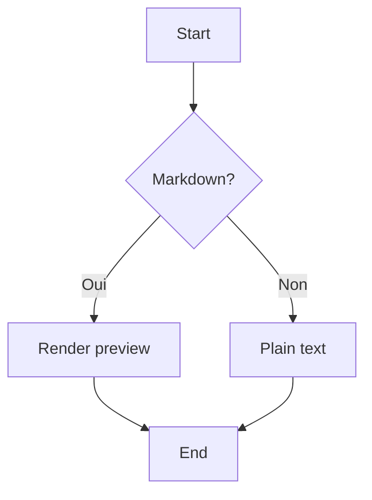

# MD Viewer — sample document

Un fichier de test couvrant tous les éléments supportés.

## Inline formatting

**Gras**, *italique*, ~~barré~~, `code inline`, et un [lien externe](https://example.com).

## Listes

- Item un
- Item deux
  - Sous-item A
  - Sous-item B
- Item trois

1. Premier
2. Deuxième
3. Troisième

### Tâches

- [x] Acheter du café
- [ ] Lire la doc MarkdownUI
- [ ] Tester le mode édition

## Citation

> « La simplicité est la sophistication suprême. »
> — Léonard de Vinci

## Code

Bloc Swift coloré par Splash :

```swift
import Foundation

struct Greeter {
    let name: String

    func sayHello() -> String {
        return "Hello, \(name)!"
    }
}
```

Bloc Python (non coloré, juste monospace) :

```python
def fib(n):
    a, b = 0, 1
    for _ in range(n):
        a, b = b, a + b
    return a
```

## Tableau

| Langage | Année | Paradigme       |
| ------- | ----- | --------------- |
| Swift   | 2014  | Multi-paradigme |
| Rust    | 2010  | Système         |
| Python  | 1991  | Multi-paradigme |

## Math (KaTeX)

L'équation de Schrödinger dépendante du temps :

$$
i\hbar \frac{\partial}{\partial t} \Psi(\mathbf{r}, t) = \hat{H} \Psi(\mathbf{r}, t)
$$

Et la formule d'Euler en bloc :

$$ e^{i\pi} + 1 = 0 $$

> Note : le math `inline` n'est pas supporté en MVP — utilisez les blocs `$$…$$`.

## Mermaid



## Ligne horizontale

---

Et un dernier paragraphe pour vérifier la marge basse.
